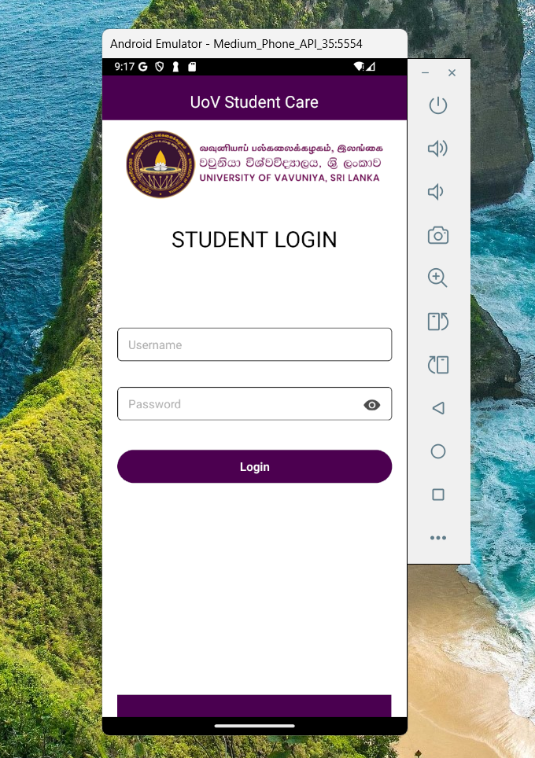
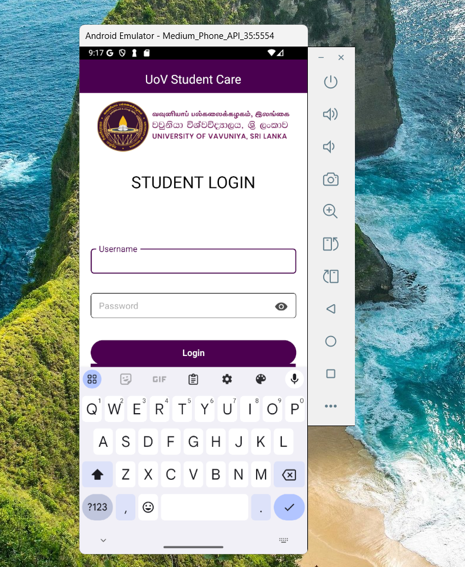
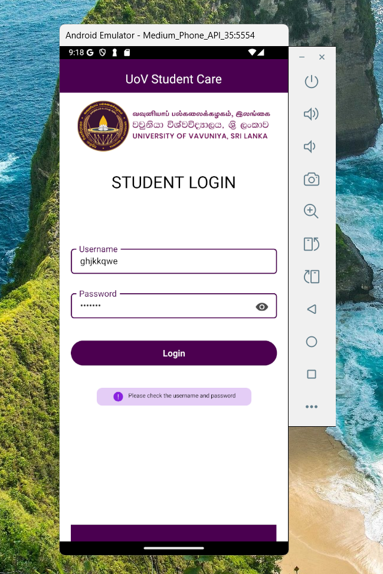
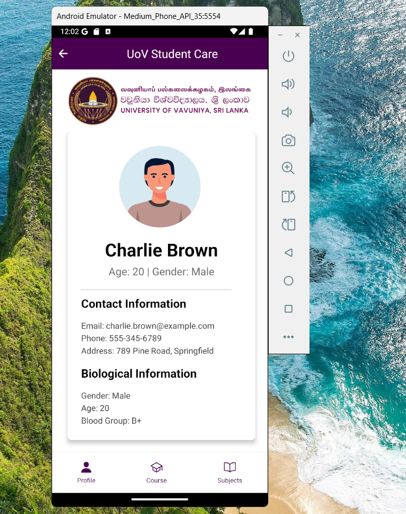
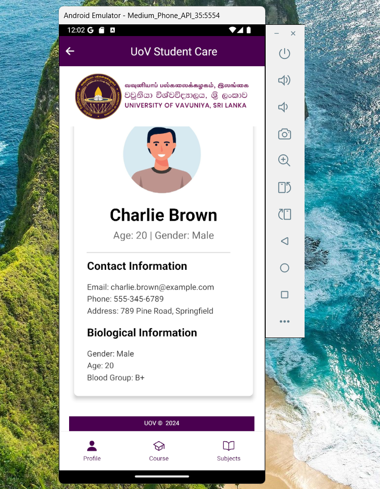
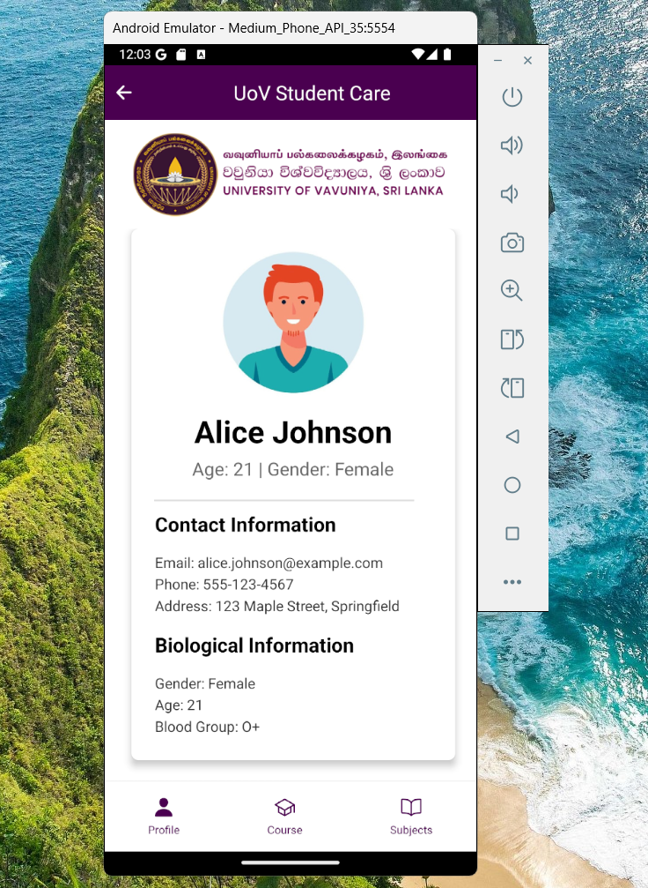
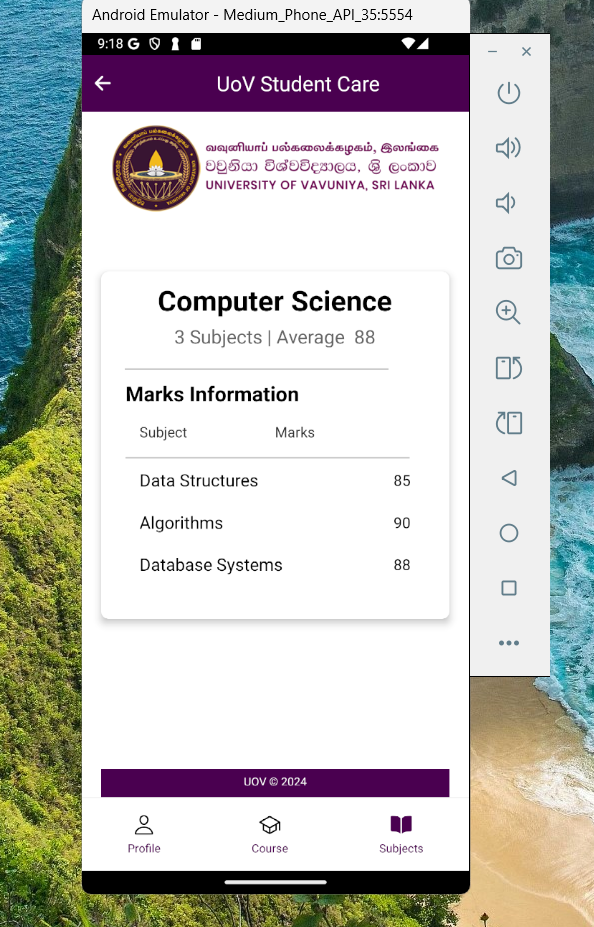

# IT3133-Assesment03
# UoV Student Care App

A React Native mobile application for University of Vavuniya (UoV) students to access their profile, course information, and subject details.

## Features

- Secure student login system
- Profile management
- Course information viewing
- Subject details access
- Responsive UI with bottom navigation
- Dark theme accents with primary color #4b0150

## Tech Stack

- React Native
- React Navigation (Stack Navigator)
- Expo Vector Icons
- React Native Vector Icons
- Custom components for modularity

## Project Structure

```
student-care-app/
├── Components/
│   ├── Header.js
│   ├── Footer.js
│   ├── Login.js
│   ├── Home.js
│   ├── Profile.js
│   ├── Course.js
│   └── Subjects.js
├── assets/
│   └── Logo/
│       └── UoV_Logo.png
├── data/
│   └── StudentDb.js
└── App.js
```

## Installation

1. Clone the repository:
```bash
git clone https://github.com/Maleesha2001-malee/IT3133-Assesment03.git
```

2. Install dependencies:
```bash
npm install
```

3. Run the application:
```bash
npx expo start
```

## Dependencies

Make sure to install the following dependencies:

```json
{
  "@react-navigation/native": "^latest",
  "@react-navigation/stack": "^latest",
  "react-native-vector-icons": "^latest",
  "@expo/vector-icons": "^latest"
}
```

## Features Details

### Login Screen
- Username and password authentication
- Animated input fields with focus states
- Error handling with visual feedback
- Show/hide password functionality

## OutPut in LoginScreen










### Home Screen
- Bottom navigation with three tabs:
  - Profile
  - Course
  - Subjects
- Header with back navigation
- UoV logo display
- Copyright footer

## OutPut Home






### Profile Section
- Display student personal information
- Contact details
- Biological information
- Profile picture display

## Output Profile Section



### Course Section
- Display student Course information
- Corse details


## Output Course Section


### Subjects Section
- Display student Subject information
- number Of Subject
- Average of Subject marks
- Student Subject Marks information


## Output Profile Section



### Custom Components
- Header: App header with navigation
- Footer: Copyright information
- Login: Authentication form
- Home: Main container with navigation
- Profile: Student information display
- Course: Course details
- Subjects: Subject information

## Styling

The application uses a consistent color scheme:
- Primary Color: #4b0150 (Deep Purple)
- Background: #ffffff (White)
- Text: Various shades of black and gray
- Error States: Custom purple (#8a23df)

## Platform Support

- iOS: Fully supported with keyboard avoiding views
- Android: Fully supported with native behaviors

## Security Features

- Secure password input
- Session management
- Protected routes
- Input validation

## Contributing

1. Fork the repository
2. Create your feature branch: `git checkout -b feature/new-feature`
3. Commit your changes: `git commit -am 'Add new feature'`
4. Push to the branch: `git push origin feature/new-feature`
5. Submit a pull request

## License

This project is licensed under the UoV © 2024

## Support

For support, please contact [support email]

## Development Notes

- Ensure proper error handling
- Follow React Native best practices
- Maintain consistent code formatting
- Document any new features or changes